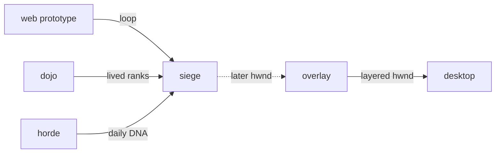

# Siege

**A small tower-defense battle at the edge of your screen.**

Seat Rui, Paint, and Reed, train between waves, then choose a daily endless challenge. Siege currently plays in the browser; the native Windows overlay is a future implementation.

Part of [ComputerPets](https://github.com/RicheyWorks/computerpets). Map: [computerpets-ecosystem](https://github.com/RicheyWorks/computerpets-ecosystem).

[Play the prototype](#run-web-prototype) · [Current features](#whats-in-this-slice) · [Design](docs/DESIGN.md) · [Native overlay status](#windows-overlay-status)

| | |
| --- | --- |
| Status | Playable web prototype (Dojo + Horde DNA). WinForms overlay still a stub. |
| License | MIT |
| Tokens | Minigames never mint or burn. Tired overlay, not a dead lineage. |
| First pet | [Meet Rui first](https://github.com/RicheyWorks/computerpets/blob/main/docs/START-HERE.md). This game is optional. |

## The loop

The browser prototype puts creeps along a simulated desktop edge. The target Windows game would run beside the flagship pet in a separate process, so closing the game would leave the pet walking.

## Who plays

Windows overlay players. This is the first game to code. The `web/` folder is the browser prototype so the loop can be felt today. `overlay/` is the future always-on-top C# process.

## What it is not

Not a horror game. Creeps are paperclips and popups. Not the Electron pet process.

## Genre and engine

- Genre: **Tower defense overlay**
- Prototype: **TanStack Start / canvas** in `web/`
- Target overlay: **C# / WinForms (or WPF)** in `overlay/`
- Default surface: `desktop overlay`

## What's in this slice

1. **Rui is home.** Paint (clownfish) and Reed (frog) seat on the screen edges. Three campaign waves.
2. **Dojo dummy.** Train between waves. Daily cap 8. Extra hits are steam, not power. Feed (14 treats) patches one desktop pip. Ranks persist in localStorage.
3. **Horde DNA.** After wave 3: **Hold the line** (endless escalating seed) or **Walk it off**. Codes: `P` paperclip, `U` popup, `A` ad. Seed is the UTC day.
4. Defeat hides Rui 30s, then the walk resumes. No permadeath.

## Architecture

The browser's local simulation is in [web/src/game/sim.ts](web/src/game/sim.ts), with daily wave logic in [horde.ts](web/src/game/horde.ts). Named companion services and the native overlay below describe intended wiring.



## How you play

1. Sit Rui down.
2. Place Paint and Reed on the dashed slots.
3. Train at the dummy. Start wave 1.
4. After three waves, hold the line or walk it off.
5. Closing the game must leave Rui walking in the real overlay (when that process exists).

## First slice

Shipped in `web/`:

**Browser canvas, Rui as one tower, 3 waves, defeat hides 30s then walk resumes.** Plus Dojo ranks and Horde DNA.

The prototype includes a reduce-motion setting. Always-on-top windows, focused-monitor behavior, and isolation from the real desktop pet are acceptance targets for the native overlay.

## Run (web prototype)

Node 22.12+, npm, and access to this private repository. From a fresh checkout:

```powershell
git clone https://github.com/RicheyWorks/computerpets-siege.git
Set-Location .\computerpets-siege\web
npm ci
npm run dev
```

Then open the printed local URL. Reduce-motion is the wave icon in the HUD.

## Windows overlay status

[overlay/Program.cs](overlay/Program.cs) is an empty entry point. There is no project file to build or run yet. The planned .NET 8 overlay and desktop integration are described in [docs/DESIGN.md](docs/DESIGN.md); they are separate from the web prototype.

## Environment

- Node 22+ for `web/`
- .NET 8 SDK for `overlay/` later

## Failure doctrine

Game crash → overlay process is separate, pet remains. Multi-monitor → defend the focused screen only. Accessibility: motion can be reduced.

Canon rules that never yield:

- 210 living kinds. No illegal hybrids.
- Overlay pets can get tired, sick, or hide. Tokens are not burned by a minigame.
- Desktop walk stays the main quest. Closing Siege must leave Rui walking.

## Neighbors

- computerpets desktop overlay
- computerpets-motion
- computerpets-dojo
- computerpets-horde (wave DNA)

## Layout

```
computerpets-siege/
  README.md
  LICENSE
  docs/DESIGN.md
  overlay/            WinForms stub (always-on-top target)
  web/                playable TanStack prototype
    src/game/         sim, render, horde DNA, dojo
    src/components/   HUD
    public/sprites/   Rui, Paint, Reed (ComputerPets art)
```

## Links

- Flagship: [RicheyWorks/computerpets](https://github.com/RicheyWorks/computerpets)
- This repo: [RicheyWorks/computerpets-siege](https://github.com/RicheyWorks/computerpets-siege)
- Map: [RicheyWorks/computerpets-ecosystem](https://github.com/RicheyWorks/computerpets-ecosystem)
- Design file: [docs/DESIGN.md](docs/DESIGN.md)

## License

MIT. See [LICENSE](LICENSE).

---

*Two hundred ten living kinds. Keep them so a line does not go quiet.*
