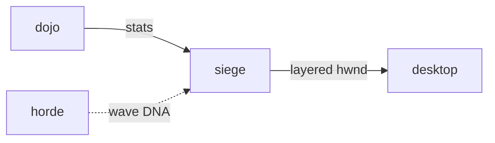

# Siege

**Desktop Pet Siege** — Tower defense on the real desktop edge — pets defend the screen from creeping bits.

Part of [ComputerPets](https://github.com/RicheyWorks/computerpets). Map: [computerpets-ecosystem](https://github.com/RicheyWorks/computerpets-ecosystem).

| | |
| --- | --- |
| Status | Design scaffold — loop and engine frozen |
| License | MIT |
| Tokens | Minigames never mint or burn. Tired overlay, not a dead lineage. |
| First pet | [Meet Rui first](https://github.com/RicheyWorks/computerpets/blob/main/docs/START-HERE.md). This game is optional. |

## The loop

The flagship pet is already a living sticker on Windows. Siege is the combat skin of that sticker: creeps climb the taskbar, Rui swats them. Close Siege, the pet still walks.

## Who plays

Windows overlay players. This is the first game to code.

## What it is not

Not a horror game. Creeps are paperclips and popups. Not the Electron pet process.

## Genre and engine

- Genre: **Tower defense overlay**
- Engine: **C# / WinForms (or WPF)**
- Stack: C# · .NET 8 · WinForms/WPF layered window · same always-on-top path as the Electron overlay
- Default surface: `desktop overlay`

## Architecture



## How you play

1. Start from desktop.ps1 extra flag or siege.exe.
2. Place up to 3 owned pets as towers on screen edges.
3. Creeps are abstract (paperclips, popups), not horror.
4. Defeat = overlay hides 30s, then walks back. No permadeath.

## First slice

Build this and stop.

**Always-on-top wave, Rui as one tower, 3 waves, defeat hides 30s then walk resumes.**

You know it works when: Siege crash leaves the pet walking. Multi-monitor: focused screen only. Reduce-motion flag.

## Environment

.NET 8 SDK

## Failure doctrine

Game crash → overlay process is separate, pet remains. Multi-monitor → defend the focused screen only. Accessibility: motion can be reduced.

Canon rules that never yield:

- 210 living kinds. No illegal hybrids.
- Overlay pets can get tired, sick, or hide. Tokens are not burned by a minigame.
- Desktop walk stays the main quest. Closing Siege must leave Rui walking.

## Neighbors

- computerpets desktop overlay
- computerpets-motion
- computerpets-dojo
- computerpets-horde (wave DNA)

## Layout

```
computerpets-siege/
  README.md
  LICENSE
  docs/DESIGN.md
  src/                implementation lands here
```

## Run (Windows)

```powershell
dotnet build src/Siege.csproj; dotnet run --project src/Siege.csproj
```

Meet Rui first via the [flagship start-here](https://github.com/RicheyWorks/computerpets/blob/main/docs/START-HERE.md). This game is optional.

## Links

- Flagship: [RicheyWorks/computerpets](https://github.com/RicheyWorks/computerpets)
- This repo: [RicheyWorks/computerpets-siege](https://github.com/RicheyWorks/computerpets-siege)
- Map: [RicheyWorks/computerpets-ecosystem](https://github.com/RicheyWorks/computerpets-ecosystem)
- Design file: [docs/DESIGN.md](docs/DESIGN.md)

## License

MIT. See [LICENSE](LICENSE).

---

*Two hundred ten living kinds. Keep them so a line does not go quiet.*
